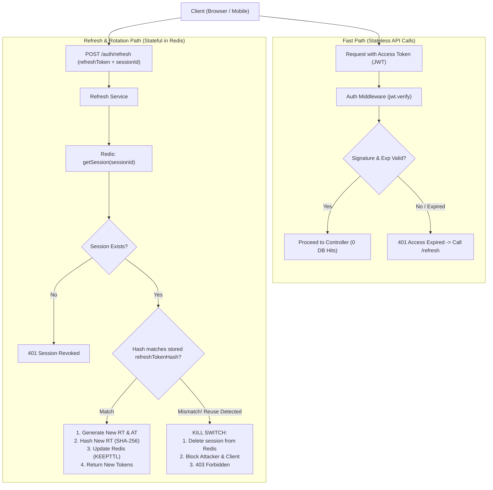

# Multi-Device Hybrid Authentication System

A production-grade, enterprise-ready authentication system built with **Node.js, Express, MongoDB, and Redis**. 

This project implements a **Hybrid Authentication Model** combining **Stateless Access Tokens (JWT)** for ultra-fast, low-latency API verification with **Stateful Device Sessions (Redis)** for fine-grained multi-device session tracking, instant remote revocation, and Refresh Token Rotation (RTR) with reuse detection.

---

## Table of Contents
- [1. Architecture Overview: What is Hybrid Auth?](#1-architecture-overview-what-is-hybrid-auth)
- [2. System Architecture Diagram](#2-system-architecture-diagram)
- [3. Key Features](#3-key-features)
- [4. Data Models & Schemas](#4-data-models--schemas)
  - [MongoDB User Schema](#mongodb-user-schema-identity--credentials)
  - [Redis Session Structure](#redis-session-structure-active-device-state)
- [5. Cryptographic Decisions & Design Patterns](#5-cryptographic-decisions--design-patterns)
  - [Why SHA-256 for Refresh Tokens instead of bcrypt?](#why-sha-256-for-refresh-tokens-instead-of-bcrypt)
  - [Why Crypto Random Bytes instead of JWT for Refresh Tokens?](#why-crypto-random-bytes-instead-of-jwt-for-refresh-tokens)
  - [The Two-Key Redis Indexing Pattern & Self-Healing](#the-two-key-redis-indexing-pattern--self-healing)
  - [Refresh Token Rotation (RTR) & Breach Detection Kill-Switch](#refresh-token-rotation-rtr--breach-detection-kill-switch)
- [6. Project Folder Structure](#6-project-folder-structure)
- [7. API Reference](#7-api-reference)
- [8. Installation & Environment Setup](#8-installation--environment-setup)
- [9. Testing Guide (Postman / cURL)](#9-testing-guide-postman--curl)

---

## 1. Architecture Overview: What is Hybrid Auth?

In modern web development, authentication architectures typically fall into two extremes:

| Architecture | Mechanism | Pros | Cons |
| :--- | :--- | :--- | :--- |
| **Pure Stateful Session** | Cookie holds Session ID; every request queries Redis/SQL database. | Instant revocation; easy multi-device tracking. | **Bottleneck**: Every single API request incurs database latency and cost. |
| **Pure Stateless JWT** | Self-contained signed token; resource servers verify signature cryptographically. | Blazing fast; scales infinitely across microservices without DB calls. | **Zero Control**: Cannot revoke tokens before expiry; cannot selectively kick out devices. |
| **Hybrid Auth (This Project)** | **Stateless Access Token (JWT)** for routine calls + **Stateful Refresh Session (Redis)** for device tracking & rotation. | **Best of both worlds**: Zero-DB API validation + Real-time multi-device visibility & revocation. | Requires managing both token issuance and Redis session storage. |

### How It Operates
1. **Routine API Calls (95%+ of traffic)**: The client presents the short-lived (15 min) Access Token. The server verifies its HMAC signature in memory. **Zero database or Redis lookups.**
2. **Session Heartbeat / Refresh**: When the Access Token expires, the client calls `/api/v1/auth/refresh` sending the Refresh Token and Session ID. The server validates the session in Redis, hashes the token with SHA-256, rotates both tokens, and updates the device's `lastActive` timestamp.
3. **Multi-Device Control**: Because sessions are tracked in Redis by `sessionId` and grouped under `user_sessions:${userId}`, users can view all logged-in devices (Chrome Laptop, iPhone Safari, etc.) and revoke access from any individual device or all devices at once.

---

## 2. System Architecture Diagram



---

## 3. Key Features

- **Multi-Device Login**: Independent sessions created per login with parsed `deviceInfo` (Browser, OS, IP address).
- **Active Device Dashboard**: `GET /api/v1/auth/sessions` lists all logged-in devices and flags the caller device (`isCurrentDevice: true`).
- **Granular Session Revocation**:
  - **Logout Current Device**: `POST /api/v1/auth/logout` deletes only the current device session from Redis.
  - **Remote Device Logout**: `DELETE /api/v1/auth/sessions/:sessionId` revokes a specific device (e.g. kick out a lost phone from your desktop).
  - **Global Logout**: `DELETE /api/v1/auth/sessions` purges all device sessions belonging to the user.
- **Refresh Token Rotation (RTR)**: Every time a refresh token is used, it is invalidated and replaced with a brand-new token.
- **Automatic Reuse / Breach Detection**: If an attacker attempts to use an old, rotated refresh token, the server immediately revokes that entire device session.
- **Self-Healing Redis Sessions**: Expired keys are cleanly removed from user tracking Sets during lookup.
- **Secure Transport**: All credentials and tokens stored in `HttpOnly`, `SameSite=Lax`, `Secure` cookies.
- **Global Password Reset Security**: Resetting a password automatically triggers a global purge of all active device sessions in Redis.

---

## 4. Data Models & Schemas

### MongoDB User Schema (Identity & Credentials)
*File: `src/features/auth/auth.model.js`*

MongoDB only stores permanent identity and authentication credentials. **No refresh tokens are stored in MongoDB.**

```javascript
{
  name: { type: String, required: true, trim: true, minLength: 2, maxLength: 50 },
  email: { type: String, required: true, unique: true, lowercase: true, trim: true },
  password: { type: String, required: true, select: false, minLength: 10 },
  bio: { type: String },
  resetPasswordToken: { type: String, select: false },
  resetPasswordExpires: { type: Date, select: false }
}
```

### Redis Session Structure (Active Device State)
*File: `src/stores/redis.sessions.store.js`*

Stored under key: `session:${sessionId}` with a 7-day TTL (`EX 604800`):

```json
{
  "sessionId": "real_sessionId",
  "userId": "real_userId",
  "refreshTokenHash": "real_refreshTokenHash",
  "deviceInfo": {
    "browser": "Chrome",
    "os": "Windows",
    "ip": "192.168.1.15"
  },
  "createdAt": "2026-10-01T05:00:00.000Z",
  "lastActive": "2026-10-01T05:15:00.000Z"
}
```

---

## 5. Cryptographic Decisions & Design Patterns

### Why SHA-256 for Refresh Tokens instead of bcrypt?

1. **Entropy Difference**:
   - **Passwords (Low Entropy)**: Humans choose predictable passwords (`Password123!`). Attackers use GPUs to guess millions per second. `bcrypt` intentionally forces a ~100ms key-stretching delay with salt rounds to prevent brute-force cracking.
   - **Refresh Tokens (High Entropy)**: Generated via `crypto.randomBytes(40).toString('hex')` (80 hex characters = 320 bits of pure cryptographic randomness). The probability of guessing a single token is $1$ in $2^{320}$ — mathematically impossible to brute-force even with all supercomputers on Earth.
2. **Event Loop Non-Blocking**:
   - `bcrypt` runs on Node's limited `libuv` thread pool (default 4 threads). Multiple concurrent token refreshes will starve the thread pool and bottleneck the server.
   - `crypto.createHash('sha256')` runs in microseconds ($< 0.005$ ms) directly in C++ OpenSSL bindings with zero thread pool contention.

### Why Crypto Random Bytes instead of JWT for Refresh Tokens?
- **Opaque Secret**: The client does not need to read the contents of a refresh token.
- **Smaller Footprint**: A 40-byte random hex string is ~80 bytes over the wire, compared to a signed JWT which is 300–500 bytes.
- **Zero Algorithmic Risk**: Cannot be attacked via JWT `alg: none` exploits or secret key brute-forcing.

### The Two-Key Redis Indexing Pattern & Self-Healing
Redis does not support secondary indexes out-of-the-box. To query sessions both by `sessionId` and by `userId`, we maintain:

1. **`session:${sessionId}` (String with TTL)**: Holds the serialized session data. Redis automatically evicts this key when the 7-day timer expires.
2. **`user_sessions:${userId}` (Set)**: Holds a collection of active `sessionId` strings for that user (`SADD`).
3. **Self-Healing (Lazy Cleanup)**: When `getUserSessions(userId)` is called, it iterates through the set members (`SMEMBERS`). If `getSession(id)` returns `null` (because Redis auto-evicted the session key), the code automatically calls `SREM user_sessions:${userId} id` to clean up the orphaned ID.

### Refresh Token Rotation (RTR) & Breach Detection Kill-Switch
1. **Normal Flow**:
   - Client sends `oldRefreshToken` and `sessionId`.
   - Server verifies `hash(oldRefreshToken) === session.refreshTokenHash`.
   - Server generates `newRefreshToken`, stores `hash(newRefreshToken)` in Redis using `'KEEPTTL'`, and sends `newRefreshToken` to client.
2. **Breach Scenario (Token Theft)**:
   - An attacker steals `oldRefreshToken`.
   - The legitimate user refreshes first $\rightarrow$ Redis now stores `hash(newRefreshToken)`.
   - The attacker later attempts to refresh using `oldRefreshToken`.
   - Server compares `hash(oldRefreshToken)` against `session.refreshTokenHash`. **They do not match.**
   - **Kill Switch Activated**: The server detects token reuse. It immediately calls `deleteSession(sessionId)`, logging out both the attacker and the legitimate device, forcing re-authentication.

---

## 6. Project Folder Structure

```
multi-Device-Auth-System-4/
├── package.json
├── server.js                        # Entry point: DB connection & server initialization
├── src/
│   ├── app.js                       # Express app configuration & middleware pipeline
│   ├── config/
│   │   ├── db.js                    # MongoDB Mongoose connection
│   │   └── redis.js                 # ioredis client initialization & event handlers
│   ├── features/
│   │   ├── auth/
│   │   │   ├── auth.controller.js   # HTTP Request/Response handling & cookie setting
│   │   │   ├── auth.middleware.js   # JWT signature verification & req.sessionId attachment
│   │   │   ├── auth.model.js        # MongoDB User model
│   │   │   ├── auth.route.js        # Express routes for authentication & sessions
│   │   │   └── auth.services.js     # Business logic: login, refresh, logout, session management
│   │   └── users/
│   │       ├── user.controller.js   # User-specific handlers (/me)
│   │       ├── user.route.js        # User route definitions
│   │       └── user.service.js      # User data retrieval service
│   ├── middlewares/
│   │   └── error.middleware.js      # Global error handling middleware
│   ├── stores/
│   │   └── redis.sessions.store.js  # Redis CRUD operations, TTL handling, and self-healing
│   └── utils/
│       ├── appError.js              # Operational error class extending Error
│       ├── catchAsync.js            # Async wrapper eliminating try/catch boilerplate
│       ├── deviceInfo.js            # User-Agent and IP address parser
│       ├── sendEmail.js             # Nodemailer email dispatch utility
│       └── token.js                 # JWT access token, crypto refresh token, and SHA-256 hash helper
├── README.md                        # Primary architecture and documentation
└── ROUTE_FLOWS.md                   # Complete route-by-route making flow guide
```

---

## 7. API Reference

| Method | Endpoint | Access | Description |
| :--- | :--- | :--- | :--- |
| `POST` | `/api/v1/auth/register` | Public | Register new user & issue initial device session |
| `POST` | `/api/v1/auth/login` | Public | Authenticate credentials & create new device session |
| `POST` | `/api/v1/auth/refresh` | Public (Cookie/Body) | Rotate refresh token & issue new access token |
| `POST` | `/api/v1/auth/logout` | Authenticated | Logout current device (deletes `req.sessionId`) |
| `GET` | `/api/v1/auth/sessions` | Authenticated | View all active devices for the user |
| `DELETE` | `/api/v1/auth/sessions/:sessionId` | Authenticated | Revoke a specific remote device |
| `DELETE` | `/api/v1/auth/sessions` | Authenticated | Logout from all devices (purge all sessions) |
| `GET` | `/api/v1/auth/profile` | Authenticated | Get currently authenticated user profile |
| `PATCH` | `/api/v1/auth/update-profile` | Authenticated | Update user bio |
| `PATCH` | `/api/v1/auth/change-password` | Authenticated | Update password using current credentials |
| `POST` | `/api/v1/auth/forgot-password` | Public | Generate reset token & send email link |
| `POST` | `/api/v1/auth/reset-password/:token`| Public | Reset password & revoke all Redis sessions |
| `GET` | `/api/v1/users/me` | Authenticated | Fetch current user account details |

---

## 8. Installation & Environment Setup

### 1. Prerequisites
- **Node.js**: v18.0.0 or higher
- **MongoDB**: Local instance running on port 27017 or MongoDB Atlas URI
- **Redis**: Local instance running on port 6379 (`redis-server`) or Redis Cloud URI

### 2. Install Dependencies
```bash
npm install
```

### 3. Environment Configuration
Create a `.env` file in the root directory:

```env
PORT=5000
NODE_ENV=development

# MongoDB
MONGO_URI=mongodb://127.0.0.1:27017/multi_device_auth

# Redis
REDIS_URI=redis://127.0.0.1:6379

# JWT Secrets
ACCESS_TOKEN_SECRET=your_super_secret_access_jwt_key_at_least_32_chars
REFRESH_TOKEN_SECRET=your_super_secret_refresh_jwt_key_at_least_32_chars

# Frontend & Mailer
FRONTEND_URL=http://localhost:3000
EMAIL_USER=your_email@gmail.com
EMAIL_PASS=your_app_specific_password
```

### 4. Start the Application
```bash
# Start in development mode
npm start
```

---

## 9. Testing Guide (Postman / cURL)

### 1. Register a Device
```bash
curl -X POST http://localhost:5000/api/v1/auth/register \
  -H "Content-Type: application/json" \
  -H "User-Agent: Mozilla/5.0 (Windows NT 10.0; Win64; x64) Chrome/122.0.0.0" \
  -d '{"name":"John Doe","email":"john@example.com","password":"Password123!"}' \
  -c cookies.txt
```

### 2. Login from a Second Device (e.g., iPhone)
```bash
curl -X POST http://localhost:5000/api/v1/auth/login \
  -H "Content-Type: application/json" \
  -H "User-Agent: Mozilla/5.0 (iPhone; CPU iPhone OS 17_0 like Mac OS X) AppleWebKit/605.1.15" \
  -d '{"email":"john@example.com","password":"Password123!"}' \
  -c iphone_cookies.txt
```

### 3. View All Active Devices
```bash
curl -X GET http://localhost:5000/api/v1/auth/sessions \
  -b cookies.txt
```
*Output lists both Windows Chrome and iPhone, marking Windows Chrome as `"isCurrentDevice": true`.*

### 4. Rotate Tokens
```bash
curl -X POST http://localhost:5000/api/v1/auth/refresh \
  -b cookies.txt \
  -c cookies.txt
```

### 5. Remote Revocation (Kick Out iPhone from Windows)
```bash
curl -X DELETE http://localhost:5000/api/v1/auth/sessions/<IPHONE_SESSION_ID> \
  -b cookies.txt
```
*Attempting to refresh from `iphone_cookies.txt` will now return `401 Session expired or revoked`.*
