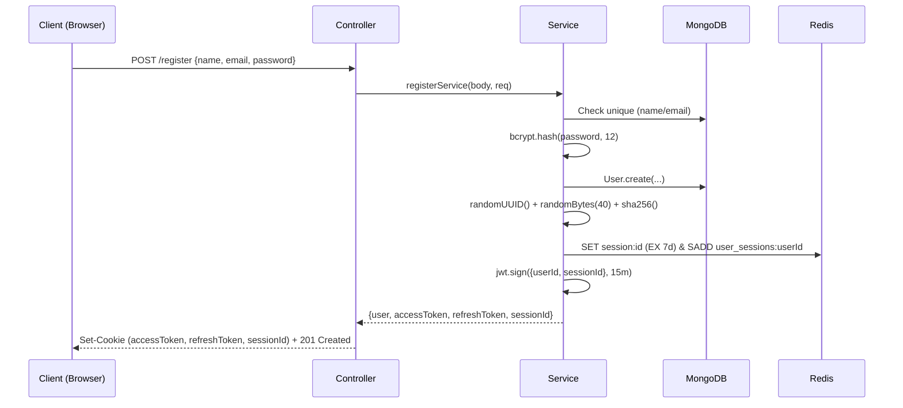
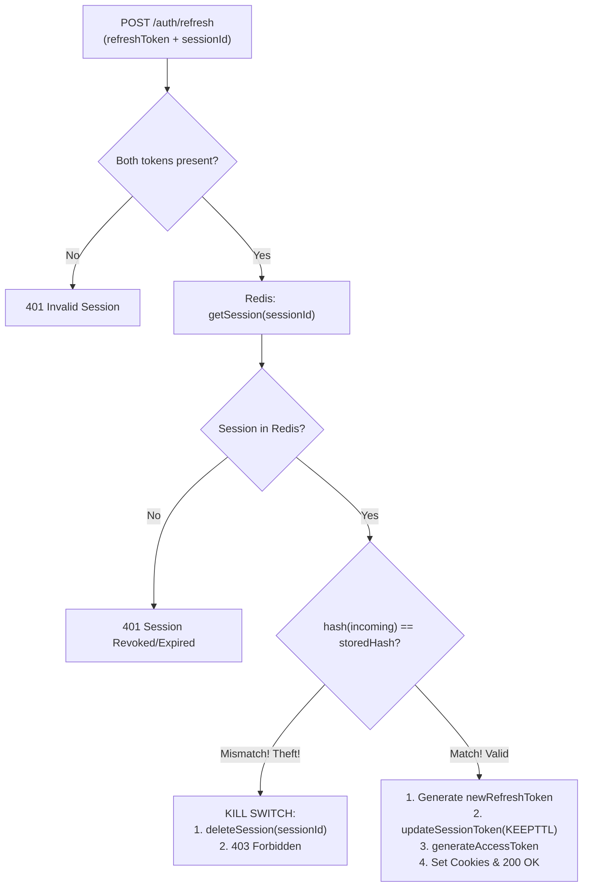

# Route-by-Route Implementation Blueprint & Execution Flows

This guide contains the step-by-step **making flow** of every route in the **Multi-Device Hybrid Authentication System**. Use this as an architectural blueprint whenever you need to build or replicate authentication in future projects.

---

## Index of Routes
1. [`POST /api/v1/auth/register`](#1-post-apiv1authregister---user-registration--initial-device-session)
2. [`POST /api/v1/auth/login`](#2-post-apiv1authlogin---device-login--session-creation)
3. [`POST /api/v1/auth/refresh`](#3-post-apiv1authrefresh---refresh-token-rotation-rtr--reuse-detection)
4. [`POST /api/v1/auth/logout`](#4-post-apiv1authlogout---logout-current-device)
5. [`GET /api/v1/auth/sessions`](#5-get-apiv1authsessions---view-active-devices)
6. [`DELETE /api/v1/auth/sessions/:sessionId`](#6-delete-apiv1authsessionssessionid---revoke-specific-remote-device)
7. [`DELETE /api/v1/auth/sessions`](#7-delete-apiv1authsessions---revoke-all-devices-logout-everywhere)
8. [`GET /api/v1/auth/profile`](#8-get-apiv1authprofile---get-current-user-profile)
9. [`PATCH /api/v1/auth/update-profile`](#9-patch-apiv1authupdate-profile---update-user-bio)
10. [`PATCH /api/v1/auth/change-password`](#10-patch-apiv1authchange-password---change-password)
11. [`POST /api/v1/auth/forgot-password`](#11-post-apiv1authforgot-password---request-password-reset-link)
12. [`POST /api/v1/auth/reset-password/:token`](#12-post-apiv1authreset-passwordtoken---reset-password--revoke-all-sessions)
13. [`GET /api/v1/users/me`](#13-get-apiv1usersme---user-details)

---

## 1. `POST /api/v1/auth/register` - User Registration & Initial Device Session

### Purpose
Registers a new user in MongoDB and immediately logs in that device by issuing an initial **stateless Access Token (JWT)**, a **stateful Refresh Token**, and creating a **Redis Device Session**.

### Making Flow (Step-by-Step Implementation)

1. **Client Request**:
   - Client sends JSON body: `{ name, email, password, bio }`.
   - Browser headers include `User-Agent` and IP address.
2. **Controller (`register`)**:
   - Calls `registerService(req.body, req)` passing both the payload and the request object (needed for device parsing).
3. **Service Logic (`registerService`)**:
   - **Validation**: Check that `name`, `email`, and `password` are present and `password.length >= 10`.
   - **Uniqueness Check**: Query MongoDB via `User.findOne({ $or: [{ name }, { email }] })`. Throw `409 Conflict` if existing.
   - **Password Hashing**: Hash password using `bcrypt.hash(password, 12)`.
   - **Persistence**: Save user document in MongoDB.
   - **Device Session Generation**:
     - Generate a new UUID: `sessionId = crypto.randomUUID()`.
     - Generate high-entropy refresh token: `rawRefreshToken = crypto.randomBytes(40).toString('hex')`.
     - Hash refresh token: `hashedRefreshToken = crypto.createHash('sha256').update(rawRefreshToken).digest('hex')`.
     - Parse device info: `deviceInfo = parseDeviceInfo(req)`.
   - **Redis Storage**:
     - Call `createSession(sessionId, sessionData)`:
       - `SET session:${sessionId} <payload> EX 604800` (7-day TTL).
       - `SADD user_sessions:${userId} ${sessionId}` (index in user's device set).
   - **Access Token Issuance**:
     - Call `generateAccessToken(user, sessionId)`:
       - Encodes payload: `{ userId: user._id, email: user.email, sessionId }`.
       - Expiry: `15m`.
4. **Cookie & Response Packaging**:
   - Set 3 `HttpOnly`, `SameSite=Lax` cookies:
     - `accessToken` (maxAge: 15 mins).
     - `refreshToken` (maxAge: 7 days).
     - `sessionId` (maxAge: 7 days).
   - Return HTTP `201 Created` with sanitized user object and `accessToken`.



- **Topics Used**: Password Hashing with Salt Rounds, High-Entropy Cryptographic Token Generation, SHA-256 One-Way Hashing, Redis String TTL (`EX`), Redis Set Indexing (`SADD`), JWT Claims Formulation, Cookie Security (`HttpOnly`, `SameSite`).
- **Technology & Packages**: `bcrypt`, `node:crypto`, `jsonwebtoken`, `mongoose`, `ioredis`, `cookie-parser`.

---

## 2. `POST /api/v1/auth/login` - Device Login & Session Creation

### Purpose
Authenticates user credentials, identifies the client's operating system/browser, assigns an independent `sessionId`, and registers a new active device in Redis.

### Making Flow (Step-by-Step Implementation)

1. **Client Request**:
   - Client sends `{ email, password }` with device headers (`User-Agent`, IP).
2. **Controller (`login`)**:
   - Calls `loginServices(req.body, req)`.
3. **Service Logic (`loginServices`)**:
   - **Credential Lookup**: Query `User.findOne({ email }).select('+password')`. Throw `401 Unauthorized` if not found.
   - **Password Verification**: Compare passwords via `bcrypt.compare(password, user.password)`. Throw `401 Unauthorized` if invalid.
   - **Device Identification**:
     - Call `parseDeviceInfo(req)` to extract `{ browser, os, ip }`.
   - **Session & Token Creation**:
     - Generate `sessionId = crypto.randomUUID()`.
     - Generate `rawRefreshToken = crypto.randomBytes(40).toString('hex')`.
     - Hash refresh token: `hashedRefreshToken = hashToken(rawRefreshToken)`.
     - Assemble session payload:
       ```json
       {
         "sessionId": "...",
         "userId": "...",
         "refreshTokenHash": "...",
         "deviceInfo": { "browser": "...", "os": "...", "ip": "..." },
         "createdAt": "ISO string",
         "lastActive": "ISO string"
       }
       ```
   - **Redis Persistence**:
     - Call `createSession(sessionId, sessionData)` $\rightarrow$ Saves `session:${sessionId}` and updates `user_sessions:${userId}`.
   - **Access Token**:
     - Sign JWT with payload `{ userId, email, sessionId }` and `expiresIn: '15m'`.
4. **Response**:
   - Set `accessToken`, `refreshToken`, and `sessionId` cookies.
   - Return HTTP `200 OK` with sanitized user object and `accessToken`.

- **Topics Used**: Constant-Time Credential Verification, User-Agent Parsing, Multi-Device Partitioning, High-Entropy Opaque Tokens, SHA-256 vs bcrypt Performance Offloading.
- **Technology & Packages**: `bcrypt`, `node:crypto`, `jsonwebtoken`, `ioredis`, `mongoose`.

---

## 3. `POST /api/v1/auth/refresh` - Refresh Token Rotation (RTR) & Reuse Detection

### Purpose
The heartbeat of the Hybrid model. Rotates the single-use refresh token, updates device activity in Redis, checks for token theft/reuse, and issues a new short-lived Access Token.

### Making Flow (Step-by-Step Implementation)

1. **Client Request**:
   - Client sends `refreshToken` and `sessionId` via `HttpOnly` cookies (or request body).
2. **Controller (`refresh`)**:
   - Validates existence of both `refreshToken` and `sessionId`. If missing, returns `401 Unauthorized`.
   - Calls `refreshServices(incomingRefreshToken, sessionId)`.
3. **Service Logic (`refreshServices`)**:
   - **Step 1: Fetch Session from Redis**:
     - Call `getSession(sessionId)`. If `null`, session has expired or was revoked $\rightarrow$ Throw `401 Unauthorized`.
   - **Step 2: Token Verification**:
     - Compute `incomingHash = hashToken(incomingRefreshToken)`.
     - Compare `incomingHash` with `session.refreshTokenHash`.
   - **Step 3: Breach Detection (Reuse Kill-Switch)**:
     - **If hashes DO NOT match**: An old, already-rotated token was submitted. This indicates token theft.
     - **Action**: Immediately execute `deleteSession(sessionId)` to wipe the session from Redis.
     - Throw `403 Forbidden` (`"Token reuse detected. Session terminated."`).
   - **Step 4: Rotate Tokens**:
     - Generate `newRefreshToken = generateRefreshToken()`.
     - Compute `newHashedRefreshToken = hashToken(newRefreshToken)`.
     - Update Redis session with new hash and `lastActive = now` using `'KEEPTTL'` to preserve remaining session duration.
     - Generate `newAccessToken = generateAccessToken(user, sessionId)`.
4. **Response**:
   - Overwrite cookies with `newAccessToken` and `newRefreshToken`.
   - Return HTTP `200 OK` with `newAccessToken`.



- **Topics Used**: Refresh Token Rotation (RTR), Cryptographic Reuse Detection (Compromise Kill-Switch), Redis Key TTL Preservation (`KEEPTTL`), Nonce/One-Time Token Pattern, Zero-Downtime Session Refresh.
- **Technology & Packages**: `ioredis`, `node:crypto`, `jsonwebtoken`, `cookie-parser`.

---

## 4. `POST /api/v1/auth/logout` - Logout Current Device

### Purpose
Logs out **only the caller's device** by deleting its specific session from Redis, leaving all other devices (phone, desktop, tablet) active.

### Making Flow (Step-by-Step Implementation)

1. **Middleware (`authenticate`)**:
   - Verifies the incoming `accessToken` JWT.
   - Attaches `req.user` and `req.sessionId = decoded.sessionId` to the request object.
2. **Controller (`logout`)**:
   - Calls `logoutServices(req.sessionId)`.
3. **Service Logic (`logoutServices`)**:
   - Calls `deleteSession(sessionId)`:
     - `getSession(sessionId)` to find the associated `userId`.
     - `SREM user_sessions:${userId} sessionId` (removes device from user's index set).
     - `DEL session:${sessionId}` (removes session data).
4. **Response**:
   - Clears cookies: `accessToken`, `refreshToken`, `sessionId` with `path: '/'`.
   - Return HTTP `200 OK` with `{ message: "Logout successful for this device" }`.

- **Topics Used**: Granular Session Teardown, Redis `SREM` & `DEL` operations, Cookie Invalidation.
- **Technology & Packages**: `ioredis`, `cookie-parser`.

---

## 5. `GET /api/v1/auth/sessions` - View Active Devices

### Purpose
Returns a dashboard list of all active logged-in devices for the authenticated user, identifying browser, OS, IP address, last active time, and highlighting the caller's current device.

### Making Flow (Step-by-Step Implementation)

1. **Middleware (`authenticate`)**:
   - Validates `accessToken` and populates `req.user._id` and `req.sessionId`.
2. **Controller (`getActiveSessions`)**:
   - Calls `getActiveSessionsService(req.user._id, req.sessionId)`.
3. **Service Logic (`getActiveSessionsService`)**:
   - Calls `getUserSessions(userId)`:
     - Executes `SMEMBERS user_sessions:${userId}` to fetch all active session IDs.
     - Loops through session IDs and runs `getSession(id)` on each.
     - **Self-Healing / Lazy Cleanup**: If `getSession(id)` returns `null` (because Redis auto-evicted the key after 7 days), it runs `SREM user_sessions:${userId} id` to clean up the dead key.
   - Maps sessions to client-safe representation:
     ```javascript
     {
       sessionId: s.sessionId,
       deviceInfo: s.deviceInfo,
       createdAt: s.createdAt,
       lastActive: s.lastActive,
       isCurrentDevice: s.sessionId === currentSessionId // Flag for UI
     }
     ```
4. **Response**:
   - Return HTTP `200 OK` with `{ sessions: [...] }`.

- **Topics Used**: Redis Set Traversal (`SMEMBERS`), Lazy Cleanup / Self-Healing Architecture, Device Fingerprinting Visualization, Contextual Session Flagging.
- **Technology & Packages**: `ioredis`.

---

## 6. `DELETE /api/v1/auth/sessions/:sessionId` - Revoke Specific Remote Device

### Purpose
Allows a user on one device (e.g. Laptop) to remotely terminate a session on another device (e.g. Lost Phone).

### Making Flow (Step-by-Step Implementation)

1. **Middleware (`authenticate`)**:
   - Validates `accessToken`, verifies caller identity.
2. **Controller (`revokeSession`)**:
   - Extracts `const { sessionId } = req.params`.
   - Calls `revokeDeviceSessionService(req.user._id, sessionId)`.
3. **Service Logic (`revokeDeviceSessionService`)**:
   - Fetches the target session from Redis: `const session = await getSession(targetSessionId)`.
   - **Authorization Check**: Verify that `session.userId === userId.toString()`. If not, or if session does not exist, throw `404 Not Found`.
   - **Teardown**: Call `deleteSession(targetSessionId)`.
     - Removes key from Redis.
     - Removes `targetSessionId` from `user_sessions:${userId}` set.
4. **Response**:
   - Return HTTP `200 OK` with `{ message: "Device session revoked successfully" }`.
   - *Result*: The target device's current access token will expire within at most 15 minutes, and its next `/refresh` request will fail with `401 Unauthorized`.

- **Topics Used**: Resource Ownership Verification, Cross-Device Remote Revocation, Access Control Validation.
- **Technology & Packages**: `ioredis`.

---

## 7. `DELETE /api/v1/auth/sessions` - Revoke All Devices (Logout Everywhere)

### Purpose
Global kill-switch. Terminates every active session across all devices simultaneously (e.g., in response to an account takeover).

### Making Flow (Step-by-Step Implementation)

1. **Middleware (`authenticate`)**:
   - Ensures valid caller credentials.
2. **Controller (`revokeAllSessions`)**:
   - Calls `revokeAllSessionsService(req.user._id)`.
3. **Service Logic (`revokeAllSessionsService`)**:
   - Calls `deleteAllUserSessions(userId)`:
     - `SMEMBERS user_sessions:${userId}` to retrieve all session IDs.
     - Constructs array of keys: `['session:id1', 'session:id2', ...]`.
     - Executes multi-key atomic deletion: `redis.del(...keysToDelete)`.
     - Deletes the set itself: `redis.del(user_sessions:${userId})`.
4. **Response**:
   - Clears caller cookies (`accessToken`, `refreshToken`, `sessionId`).
   - Return HTTP `200 OK` with `{ message: "Logged out from all devices successfully" }`.

- **Topics Used**: Atomic Bulk Deletion (`DEL ...keys`), Global State Purge, Emergency Access Invalidation.
- **Technology & Packages**: `ioredis`, `cookie-parser`.

---

## 8. `GET /api/v1/auth/profile` - Get Current User Profile

### Purpose
Protected resource returning the authenticated user's profile without database querying if data is already in JWT or pre-loaded by middleware.

### Making Flow (Step-by-Step Implementation)

1. **Middleware (`authenticate`)**:
   - Verifies JWT access token via `jwt.verify()`.
   - Loads user from MongoDB (`User.findById(decoded.userId).select('-password')`).
   - Attaches `req.user = user`.
2. **Controller (`myprofile`)**:
   - Sends back `req.user`.
3. **Response**:
   - Return HTTP `200 OK` with `{ user: req.user }`.

- **Topics Used**: JWT Verification, Middleware Request Augmentation, Sensitive Field Exclusion (`select('-password')`).
- **Technology & Packages**: `jsonwebtoken`, `mongoose`.

---

## 9. `PATCH /api/v1/auth/update-profile` - Update User Bio

### Purpose
Allows authenticated users to update profile details (e.g. bio) with validation.

### Making Flow (Step-by-Step Implementation)

1. **Middleware (`authenticate`)**:
   - Ensures user is logged in (`req.user._id`).
2. **Controller (`updateProfile`)**:
   - Extracts `{ bio } = req.body`.
   - Calls `updateUserService(req.user._id, bio)`.
3. **Service Logic (`updateUserService`)**:
   - Executes `User.findByIdAndUpdate(userId, { bio }, { returnDocument: 'after', runValidators: true })`.
4. **Response**:
   - Return HTTP `200 OK` with updated user object.

- **Topics Used**: Schema Validators (`runValidators: true`), Atomic MongoDB Updates (`findByIdAndUpdate`).
- **Technology & Packages**: `mongoose`.

---

## 10. `PATCH /api/v1/auth/change-password` - Change Password

### Purpose
Allows an authenticated user to change their password by validating their current password first.

### Making Flow (Step-by-Step Implementation)

1. **Middleware (`authenticate`)**:
   - Authenticates caller.
2. **Controller (`changePassword`)**:
   - Calls `changePasswordService(req.body, req.user._id)`.
3. **Service Logic (`changePasswordService`)**:
   - Validates `currentPassword` and `newPassword` length ($>= 10$).
   - Fetches user with password: `User.findById(id).select('+password')`.
   - Verifies current password: `bcrypt.compare(currentPassword, user.password)`. Throw `400` if invalid.
   - Ensures `newPassword !== currentPassword`. Throw `400` if identical.
   - Hashes new password: `user.password = await bcrypt.hash(newPassword, 12)`.
   - Saves user document: `await user.save({ validateBeforeSave: false })`.
4. **Response**:
   - Return HTTP `200 OK` with `{ message: "Password changed successfully" }`.

- **Topics Used**: Re-Authentication Check, Password Disparity Validation, Key Stretching.
- **Technology & Packages**: `bcrypt`, `mongoose`.

---

## 11. `POST /api/v1/auth/forgot-password` - Request Password Reset Link

### Purpose
Issues a secure, time-limited password reset token and dispatches an HTML email link.

### Making Flow (Step-by-Step Implementation)

1. **Controller (`forgotPassword`)**:
   - Calls `forgotPasswordService(req.body)`.
2. **Service Logic (`forgotPasswordService`)**:
   - Looks up user by email: `User.findOne({ email })`.
   - **Timing Attack Mitigation**: If user is not found, return generic success message rather than disclosing whether the email exists.
   - Generate cryptographically secure random token: `resetToken = crypto.randomBytes(32).toString('hex')`.
   - Hash token for storage: `hashedToken = crypto.createHash('sha256').update(resetToken).digest('hex')`.
   - Store in MongoDB: `user.resetPasswordToken = hashedToken` and `user.resetPasswordExpires = Date.now() + 15 * 60 * 1000` (15 mins).
   - Dispatch reset email via `sendEmail({ to, subject, html })`.
3. **Response**:
   - Return HTTP `200 OK` with generic notification message.

- **Topics Used**: User Enumeration Prevention, Cryptographic Reset Tokens, SHA-256 Hash Matching, Email Dispatch.
- **Technology & Packages**: `node:crypto`, `nodemailer`, `mongoose`.

---

## 12. `POST /api/v1/auth/reset-password/:token` - Reset Password & Revoke All Sessions

### Purpose
Resets the user's password using the one-time token and **purges all active Redis device sessions** to ensure total account lockdown.

### Making Flow (Step-by-Step Implementation)

1. **Controller (`resetPassword`)**:
   - Extracts `token` from `req.params` and `newPassword` from `req.body`.
   - Calls `resetPasswordService(token, req.body)`.
2. **Service Logic (`resetPasswordService`)**:
   - Hashes incoming parameter: `hashedToken = hashToken(token)`.
   - Finds matching non-expired user:
     ```javascript
     User.findOne({
       resetPasswordToken: hashedToken,
       resetPasswordExpires: { $gt: Date.now() }
     }).select('+resetPasswordToken +resetPasswordExpires')
     ```
   - If not found or expired, throw `AppError('Invalid or expired reset token', 400)`.
   - Update password with `bcrypt.hash(newPassword, 12)`.
   - Clear reset fields: `user.resetPasswordToken = undefined`, `user.resetPasswordExpires = undefined`.
   - Save user to MongoDB.
   - **Global Session Revocation**: Execute `await deleteAllUserSessions(user._id.toString())`.
3. **Response**:
   - Return HTTP `200 OK` with `{ message: "Password Reset Successfully. Please log in again" }`.

- **Topics Used**: Token Invalidation, Time-Window Enforcement (`$gt: Date.now()`), Post-Reset Global Session Eviction.
- **Technology & Packages**: `node:crypto`, `bcrypt`, `mongoose`, `ioredis`.

---

## 13. `GET /api/v1/users/me` - User Details

### Purpose
Independent user module endpoint to fetch current account details.

### Making Flow (Step-by-Step Implementation)

1. **Middleware (`authenticate`)**:
   - Verifies JWT, populates `req.user`.
2. **Controller (`me`)**:
   - Calls `getMeService(req.user._id)`.
3. **Service Logic (`getMeService`)**:
   - `User.findById(id)`. Throw `401` if user no longer exists.
4. **Response**:
   - Return HTTP `200 OK` with sanitized `{ id, name, email }`.

- **Topics Used**: Modular Resource Segregation, Middleware State Consumption.
- **Technology & Packages**: `mongoose`.

---

## Summary Matrix of Technologies & Concepts Across Routes

| Route | Primary Topics Used | Core Packages Used |
| :--- | :--- | :--- |
| `POST /register` | bcrypt hashing, crypto random bytes, SHA-256, Redis TTL & Set Index, JWT signing, HttpOnly cookies | `bcrypt`, `crypto`, `jsonwebtoken`, `ioredis`, `mongoose` |
| `POST /login` | Constant-time password comparison, User-Agent parsing, Redis session storage, JWT claims | `bcrypt`, `crypto`, `jsonwebtoken`, `ioredis`, `mongoose` |
| `POST /refresh` | Refresh Token Rotation (RTR), Reuse Detection Kill-Switch, Redis `KEEPTTL`, SHA-256 hash check | `crypto`, `ioredis`, `jsonwebtoken`, `cookie-parser` |
| `POST /logout` | Redis `SREM` and `DEL`, Cookie clearing | `ioredis`, `cookie-parser` |
| `GET /sessions` | Redis `SMEMBERS`, Lazy Cleanup / Self-Healing Set, Contextual device flagging | `ioredis` |
| `DELETE /sessions/:id`| Resource ownership check, Remote device session revocation | `ioredis` |
| `DELETE /sessions` | Redis multi-key atomic deletion (`DEL ...keys`), Global account purge | `ioredis`, `cookie-parser` |
| `GET /profile` | JWT signature verification, MongoDB field projection (`select`) | `jsonwebtoken`, `mongoose` |
| `PATCH /update-profile`| MongoDB atomic update, schema validator execution | `mongoose` |
| `PATCH /change-password`| Credential re-verification, password mismatch enforcement, bcrypt hashing | `bcrypt`, `mongoose` |
| `POST /forgot-password`| User enumeration mitigation, SHA-256 token hashing, SMTP email dispatch | `crypto`, `nodemailer`, `mongoose` |
| `POST /reset-password` | Expiry window query (`$gt`), Global Redis session eviction | `crypto`, `bcrypt`, `ioredis`, `mongoose` |
| `GET /users/me` | Modular controller separation, middleware state extraction | `mongoose` |
