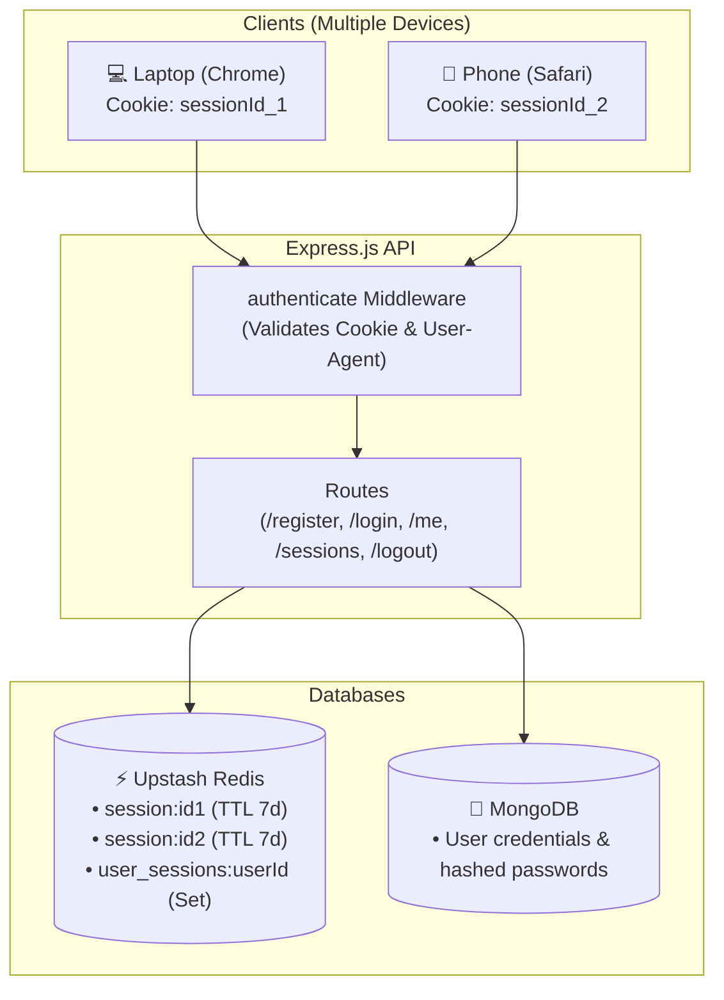

# Project 3: Session-Based Authentication System

**Difficulty:** Intermediate  
**Architecture:** Layered Architecture (Routes → Controllers → Services → Stores → Config)  
**Tech Stack:** Node.js, Express.js (v5), MongoDB (Mongoose), Upstash Redis (`ioredis`), Bcrypt, Cookie-Parser

---

## 📌 Project Overview

This project implements a production-grade, stateful, server-side session authentication system built from the ground up without using high-level black-box packages like `express-session`. 

It demonstrates how browsers, cookies, HTTP headers, in-memory/Redis stores, and database models interact to deliver secure authentication, multiple-device session tracking, instant revocation, and session hijacking prevention.

---

## 🚀 Features Implemented

| Feature | Description | Status |
| :--- | :--- | :---: |
| **User Registration** | Validates input, hashes passwords using `bcrypt` (12 rounds), stores records in MongoDB, and excludes password hashes from responses. | ✅ Complete |
| **User Login** | Verifies credentials, generates a 32-byte cryptographically secure session ID, captures device metadata (`userAgent`, `ip`), and sets an `httpOnly`, `sameSite: 'lax'` cookie. | ✅ Complete |
| **Session Creation** | Stores session state in Redis with automatic TTL expiration and indexes session IDs in a per-user Redis Set. | ✅ Complete |
| **Session Expiration** | **Dual-layer expiration**: Redis automatically purges expired keys via TTL (`EX`), while middleware performs lazy expiration and cookie clearance upon request. | ✅ Complete |
| **Single-Device Logout** | `POST /auth/logout` destroys the active session from Redis and clears the cookie on the browser. | ✅ Complete |
| **Session Destruction** | Targeted revocation (`DELETE /auth/sessions/:sessionId`) and mass revocation (`POST /auth/logout-all`). | ✅ Complete |
| **Multiple-Device Sessions** | Tracks all active sessions for a user across different browsers/devices. `GET /auth/sessions` lists all active logins with device details. | ✅ Complete |
| **Session Hijacking Defense** | Validates incoming request `User-Agent` against the session's registered `userAgent`. If a cookie is stolen and used from a different browser, the session is immediately destroyed. | ✅ Complete |

---

## 🏗️ System Architecture



---

## 📡 API Endpoints

### 1. Public Authentication Routes (`/auth`)

| Method | Endpoint | Description | Request Body |
| :--- | :--- | :--- | :--- |
| `POST` | `/auth/register` | Register a new user | `{ "name": "...", "email": "...", "password": "..." }` |
| `POST` | `/auth/login` | Login & receive `sessionId` cookie | `{ "email": "...", "password": "..." }` |
| `POST` | `/auth/logout` | Logout current device & clear cookie | None (reads cookie/header) |

### 2. Protected Session & User Routes (Requires `authenticate` Middleware)

| Method | Endpoint | Description |
| :--- | :--- | :--- |
| `GET` | `/user/me` | Fetch profile details of logged-in user |
| `GET` | `/auth/sessions` | View all active devices logged in for current user |
| `POST` | `/auth/logout-all` | Log out from all devices simultaneously |
| `DELETE` | `/auth/sessions/:sessionId` | Remotely revoke one specific device session |

---

## 💡 Core Concepts & Learnings

### 1. Cookies & Browser Security
* **`httpOnly: true`**: Prohibits client-side JavaScript (`document.cookie`) from accessing the session cookie, eliminating XSS token theft.
* **`sameSite: 'lax'`**: Restricts cookie transmission on cross-site requests, mitigating Cross-Site Request Forgery (CSRF).
* **`secure: true`**: Ensures cookies are only transmitted over encrypted HTTPS connections in production.
* **Cookie Deletion**: Servers cannot directly delete files on client disks; `res.clearCookie` works by issuing a `Set-Cookie` header with an expiration timestamp in 1970 (`maxAge: 0`).

### 2. Redis Data Structures for Sessions
* **String with TTL**: `SET session:<sessionId> <JSON_PAYLOAD> EX <seconds>` — Stores session metadata with automated background eviction.
* **Sets for User Devices**: `SADD user_sessions:<userId> <sessionId>` — Tracks which sessions belong to which user for fast lookup (`SMEMBERS`) and multi-device management.

### 3. Active vs. Passive Expiration
* **Active (Background) Expiration**: Redis automatically drops expired keys once their TTL reaches zero.
* **Passive (Lazy) Expiration**: Middleware checks `Date.now() > expiresAt`. If expired, it removes the dead key from the store and instructs the browser to clear the cookie.

### 4. Device Fingerprinting (Session Hijacking Protection)
* Stores `req.headers['user-agent']` at login.
* Middleware compares the current request's `User-Agent` against the stored `userAgent`.
* If a session cookie is stolen and used from a different client, access is denied (`401 Unauthorized`) and the compromised session is destroyed.

### 5. Sessions (Stateful) vs. JWTs (Stateless)

| Feature | Session-Based (Stateful) | JWT (Stateless) |
| :--- | :--- | :--- |
| **State Location** | Server (Redis / Memory) | Client (Inside encoded token) |
| **Instant Revocation** | **Trivial**: Delete key from Redis, user is instantly logged out. | **Difficult**: Token remains valid until expiration unless a blacklist is kept. |
| **Multi-Device Control**| Full visibility and remote logout capability. | Server cannot list or revoke individual devices easily. |
| **Scalability** | Requires a shared fast store (Redis). | Scales horizontally without database lookup. |

---

## ⚙️ Environment Configuration (`.env`)

```env
PORT=3000
MONGO_URI=mongodb://127.0.0.1:27017/sessionProject
REDIS_URI=rediss://default:<password>@<host>.upstash.io:6379
```

---

## 🏃 Running the Application

```bash
# 1. Install dependencies
npm install

# 2. Start server
npm start
```

