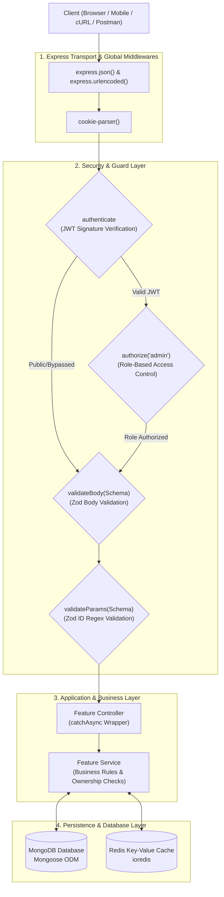
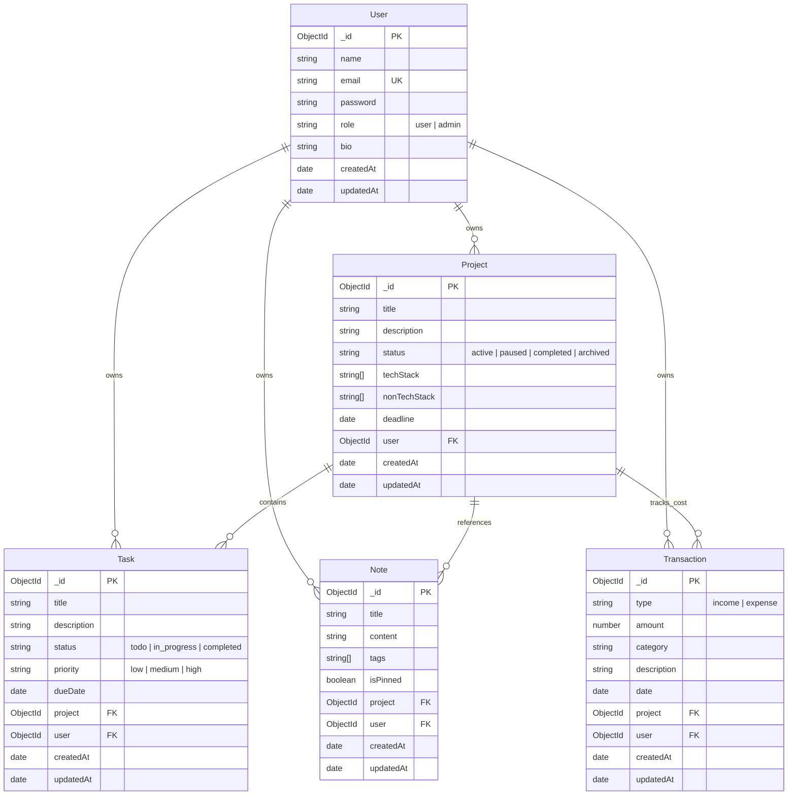

# WorkFlowX — Complete Enterprise Backend REST API

> **WorkFlowX** is a modular, high-performance, enterprise-ready backend REST API built with **Node.js, Express, MongoDB (Mongoose), and Redis**. It delivers a unified workspace for managing **Projects, Tasks, Notes, Financial Transactions (Income & Expenses), Multi-Device Authentication, Real-Time Aggregated Dashboards, and Role-Based Admin Governance**.

---

##  Table of Contents

1. [Executive Summary & Learning Philosophy](#1-executive-summary--learning-philosophy)
2. [Scope Boundaries: What WorkFlowX Is vs. Is NOT](#2-scope-boundaries-what-workflowx-is-vs-is-not)
3. [System Architecture & Request Lifecycle](#3-system-architecture--request-lifecycle)
4. [Database Modeling & Entity-Relationship Diagram (ERD)](#4-database-modeling--entity-relationship-diagram-erd)
5. [In-Depth Feature Modules](#5-in-depth-feature-modules)
   - [5.1 Hybrid Authentication & Multi-Device Sessions](#51-hybrid-authentication--multi-device-sessions)
   - [5.2 Projects Management Engine](#52-projects-management-engine)
   - [5.3 Tasks Engine & Cross-Collection Relationships](#53-tasks-engine--cross-collection-relationships)
   - [5.4 Notes & High-Performance Tagging System](#54-notes--high-performance-tagging-system)
   - [5.5 Financial Engine (Income, Expenses & Aggregation)](#55-financial-engine-income-expenses--aggregation)
   - [5.6 Dashboard Analytics Engine](#56-dashboard-analytics-engine)
   - [5.7 Admin RBAC & Governance](#57-admin-rbac--governance)
6. [Security, Error Handling & Validation Standards](#6-security-error-handling--validation-standards)
7. [Comprehensive REST API Reference Matrix](#7-comprehensive-rest-api-reference-matrix)
8. [Codebase Directory Structure](#8-codebase-directory-structure)
9. [Installation & Environment Setup](#9-installation--environment-setup)
10. [End-to-End Testing & Verification Guide (cURL Cookbook)](#10-end-to-end-testing--verification-guide-curl-cookbook)

---

## 1. Executive Summary & Learning Philosophy

WorkFlowX was designed from the ground up to demonstrate production-grade Node.js backend patterns, avoiding quick shortcuts or monolithic anti-patterns.

### Core Architectural Pillars
* **Feature-Based Modular Architecture:** Code is organized by domain feature (`auth`, `users`, `projects`, `tasks`, `notes`, `transactions`, `dashboard`, `admin`) rather than by technical layer (`all controllers in one folder`). Each feature encapsulates its own model, controller, service, validation, middleware, and route definitions.
* **Separation of Concerns:**
  * **Routes:** Route matching, URL parameters, and middleware chaining order.
  * **Middlewares:** Authentication, role authorization, request body/param validation.
  * **Controllers:** HTTP transport layer, request parsing, status code dispatching.
  * **Services:** Pure business logic, database queries, cross-collection checks, aggregation pipelines.
  * **Models:** Data integrity, schemas, validation rules, indexes.
* **Dual Persistence Layer:**
  * **MongoDB:** Document database for ACID transactions, complex document relationships, compound indexes, and aggregation pipelines.
  * **Redis (`ioredis`):** High-speed in-memory key-value store for session state, device fingerprinting, TTL auto-eviction, and token rotation tracking.
* **Type-Safe Runtime Validation (Zod):** Strict schema enforcement on incoming HTTP payloads, date coercions, lowercase normalizations, and custom refinements.

---

## 2. Scope Boundaries: What WorkFlowX Is vs. Is NOT

To maintain architectural focus and code quality, the system establishes clear boundaries:

|  What WorkFlowX IS |  What WorkFlowX IS NOT (Strict Non-Goals) |
| :--- | :--- |
| Modular REST API with clean HTTP semantics |  Payment Gateway / Stripe / Banking API |
| Hybrid JWT + Redis Session Management |  WebSockets / Real-Time Chat |
| Cross-collection authorization & data isolation |  Third-party OAuth / Social Logins |
| Advanced MongoDB Aggregation Pipelines |  AI / Machine Learning Recommendation Engines |
| Role-Based Access Control (RBAC) with Cascade Deletion |  Microservices / Kubernetes / Docker clusters |
| Compound In-RAM Indexing & Pagination |  Message Queues (RabbitMQ/Kafka) / Background workers |
| Centralized error handling and Zod validations |  GraphQL / Elasticsearch |

---

## 3. System Architecture & Request Lifecycle



---

## 4. Database Modeling & Entity-Relationship Diagram (ERD)



---

## 5. In-Depth Feature Modules

---

### 5.1 Hybrid Authentication & Multi-Device Sessions

WorkFlowX solves the classic architectural dilemma between **stateless JWTs** and **stateful sessions** by implementing a **Hybrid Model**:

```
                       ┌───────────────────────────────────────────────┐
                       │              HYBRID AUTH MODEL                │
                       └───────────────────────┬───────────────────────┘
                                               │
                    ┌──────────────────────────┴──────────────────────────┐
                    ▼                                                     ▼
     Stateless Access Token (JWT)                         Stateful Refresh Session (Redis)
     • Short-lived: 15 minutes                            • Long-lived: 7 days
     • Zero database/Redis queries                        • Stored in Redis: session:${sessionId}
     • In-memory cryptographic verification               • Tracked in User Set: user_sessions:${userId}
     • Ultra-low latency for 95%+ of traffic              • Granular device visibility & remote logout
```

#### Cryptographic Decisions:
1. **Why SHA-256 for Refresh Tokens instead of bcrypt?**
   * **Passwords (Low Entropy):** Passwords chosen by humans have low entropy (`Password123!`). `bcrypt` is intentionally computationally expensive with adaptive cost factors to prevent brute-force cracking on GPUs.
   * **Refresh Tokens (High Entropy):** Generated via `crypto.randomBytes(40).toString('hex')` (80 hex chars = 320 bits of pure cryptographic randomness). The probability of guessing a token is $1$ in $2^{320}$ (astronomically impossible to brute-force).
   * **Thread Pool Protection:** `bcrypt` runs on Node’s limited `libuv` thread pool (default 4 threads). Multiple concurrent token refreshes would block the event loop. `crypto.createHash('sha256')` runs in microseconds ($< 0.005$ ms) in native OpenSSL bindings without thread pool contention.
2. **Refresh Token Rotation (RTR) & Breach Detection Kill-Switch:**
   * Every time `/auth/refresh` is called, the existing refresh token is invalidated and a brand-new token pair is issued.
   * If an attacker steals an old refresh token and attempts to use it after the legitimate user has already rotated it, the server detects a hash mismatch.
   * **Automated Kill Switch:** The server instantly revokes that entire device session from Redis, terminating both the attacker and the legitimate device, forcing manual re-authentication.
3. **Self-Healing Redis Sessions:**
   * Sessions are indexed in Redis Sets (`user_sessions:${userId}`). When `/auth/sessions` is fetched, the server scans the set and lazily removes (`SREM`) any expired or evicted session keys.

---

### 5.2 Projects Management Engine

* **Schema Definition:** `title`, `description`, `status` (`active`, `paused`, `completed`, `archived`), `techStack`, `nonTechStack`, `deadline`, and `user`.
* **Mandatory Deadlines:** Required date validated with Zod coercion (`z.coerce.date()`).
* **Tenant Scoping:** All operations strictly enforce `{ user: req.user._id }`. Even if a user guesses another user's project ID, MongoDB will return `404 Not Found`.
* **Query Features:**
  * **Search:** Case-insensitive regex across `title` and `description`.
  * **Filtering:** Query by `status`.
  * **Sorting:** Dynamic multi-field sorting (`?sort=-createdAt` or `?sort=title`).
  * **Pagination:** Standard `page` and `limit` with computed `totalPages`, `hasNextPage`, and `hasPrevPage`.

---

### 5.3 Tasks Engine & Cross-Collection Relationships

* **Status & Priority:** `status` (`todo`, `in_progress`, `completed`), `priority` (`low`, `medium`, `high`).
* **Cross-Collection Authorization (Security Critical):**
  * When a user creates or updates a task with `{ project: "<projectId>" }`, the service queries the `Project` model:
    ```javascript
    const projectExists = await Project.findOne({ _id: taskData.project, user: userId });
    if (!projectExists) throw new AppError('Referenced project not found or does not belong to you', 404);
    ```
  * This prevents malicious actors from attaching their tasks to other users' private projects.
* **Standalone Tasks:** Tasks can be completely independent of projects (`project: null`). Users can query independent tasks specifically via `GET /api/v1/tasks?project=none`.
* **Mongoose Population:** Resolves foreign key references into populated objects: `.populate('project', 'title status')`.

---

### 5.4 Notes & High-Performance Tagging System

* **Content & Tags:** Supports titles, detailed notes (up to 5,000 characters), and an array of tags.
* **Tag Normalization:** Tags are automatically trimmed and lowercased during Zod validation.
* **Compound In-RAM Indexing:**
  ```javascript
  notesSchema.index({ user: 1, isPinned: -1, updatedAt: -1 });
  ```
  * When fetching a user's notes, pinned notes (`isPinned: true`) must appear at the top, sorted newest to oldest.
  * This compound index allows MongoDB to fulfill this sort directly in RAM, eliminating costly in-memory sort stages.
* **Array Filtering:** Supports filtering by single tag or multiple comma-separated tags using MongoDB's `$in` operator (`?tags=backend,api`).

---

### 5.5 Financial Engine (Income, Expenses & Aggregation)

* **Positive Amount Rule:** Financial models store all amounts as positive numbers ($> 0$), with an enum `type: 'income' | 'expense'`. Negative amounts are strictly forbidden by schema validators.
* **Occurrence Date vs. Created At:** The `date` field reflects when the financial transaction occurred, while `createdAt` records when it was entered into the database.
* **Date Range Queries:** Filter transactions using `$gte` and `$lte` operators (`?startDate=YYYY-MM-DD&endDate=YYYY-MM-DD`).
* **Financial Summary Aggregation Pipeline (`/summary`):**
  * Stage 1: `$match` filters transactions for the user within optional date boundaries.
  * Stage 2: `$group` calculates `totalIncome` and `totalExpense` by grouping on `'$type'`.
  * Stage 3: Secondary aggregation groups expenses by `'$category'`, sums `totalSpent`, and sorts descending (`$sort: { totalSpent: -1 }`).
  * Computes `netBalance = totalIncome - totalExpense`.

---

### 5.6 Dashboard Analytics Engine

* **No Dedicated Model:** The dashboard is an **analytical aggregation service**, computing metrics dynamically across all four core collections.
* **Concurrent Execution (`Promise.all`):** Executes 6 independent database operations simultaneously:
  1. `Project.aggregate` — Grouped by status.
  2. `Task.aggregate` — Grouped by status.
  3. `Task.countDocuments` — Overdue tasks (`dueDate < now && status != 'completed'`).
  4. `Note.aggregate` — Total notes and pinned notes using conditional aggregation (`$cond`).
  5. `Transaction.aggregate` — Total income and total expenses.
  6. `Task.find` — Top 5 upcoming urgent tasks ordered by `dueDate: 1`.
* **Response Time:** Sub-50ms execution time due to parallel asynchronous execution.

---

### 5.7 Admin RBAC & Governance

* **Role-Based Access Control:** Dual-middleware protection:
  ```javascript
  router.use(authenticate);
  router.use(authorize('admin'));
  ```
* **Platform Metrics (`GET /admin/stats`):** Aggregates global system counts (total users, projects, tasks, notes, transactions, and cumulative money volume across the entire platform).
* **Cascade Deletion (`DELETE /admin/users/:id`):** When an admin deletes a user, the system automatically purges all child records across `Project`, `Task`, `Note`, and `Transaction` models in parallel, preventing orphaned documents.
* **Safety Safeguards:** Admins are programmatically prohibited from deleting or demoting their own account to prevent administrative self-lockout.

---

## 6. Security, Error Handling & Validation Standards

### A. Operational Error Architecture (`AppError`)
Custom error class extending JavaScript's native `Error`:
```javascript
class AppError extends Error {
    constructor(message, statusCode) {
        super(message);
        this.statusCode = statusCode || 500;
        this.status = `${statusCode}`.startsWith('4') ? 'Fail' : 'Error';
        this.isOperational = true;
        Error.captureStackTrace(this, this.constructor);
    }
}
```

### B. Async Boilerplate Elimination (`catchAsync`)
Higher-order wrapper replacing repetitive `try / catch` blocks across all controllers:
```javascript
export const catchAsync = (fn) => (req, res, next) => {
    fn(req, res, next).catch(next);
};
```

### C. Zod Validation Middlewares
Reusable higher-order functions validating request bodies and route parameters:
* `validateBody(schema)`: Parses, sanitizes, and replaces `req.body` with validated data.
* `validateParams(schema)`: Validates URL parameters (such as verifying MongoDB ObjectIds are 24-character hexadecimal strings) before hitting controllers.

---

## 7. Comprehensive REST API Reference Matrix

###  Authentication & Session Endpoints (`/api/v1/auth`)
| Method | Endpoint | Access | Request Body / Params | Description |
| :--- | :--- | :--- | :--- | :--- |
| `POST` | `/api/v1/auth/register` | Public | `{ name, email, password, bio? }` | Register user & create initial device session |
| `POST` | `/api/v1/auth/login` | Public | `{ email, password }` | Authenticate & create new device session |
| `POST` | `/api/v1/auth/refresh` | Public | Cookies / `{ refreshToken, sessionId }` | Rotate refresh token & issue new access token |
| `POST` | `/api/v1/auth/logout` | Auth | None (reads `req.sessionId`) | Log out calling device session |
| `GET` | `/api/v1/auth/sessions` | Auth | None | List all active devices for user |
| `DELETE`| `/api/v1/auth/sessions/:sessionId` | Auth | URL param: `sessionId` | Remotely revoke a specific device |
| `DELETE`| `/api/v1/auth/sessions` | Auth | None | Revoke all devices (logout everywhere) |
| `GET` | `/api/v1/auth/profile` | Auth | None | Get authenticated user profile |
| `PATCH`| `/api/v1/auth/update-profile` | Auth | `{ bio }` | Update user bio |
| `PATCH`| `/api/v1/auth/change-password` | Auth | `{ currentPassword, newPassword }` | Change password with verification |
| `POST` | `/api/v1/auth/forgot-password` | Public | `{ email }` | Send password reset link |
| `POST` | `/api/v1/auth/reset-password/:token`| Public | `{ password }`, URL param: `token` | Reset password & purge all Redis sessions |

###  User Endpoints (`/api/v1/users`)
| Method | Endpoint | Access | Query / Body | Description |
| :--- | :--- | :--- | :--- | :--- |
| `GET` | `/api/v1/users/me` | Auth | None | Fetch current authenticated user |

###  Project Endpoints (`/api/v1/projects`)
| Method | Endpoint | Access | Query / Body | Description |
| :--- | :--- | :--- | :--- | :--- |
| `POST` | `/api/v1/projects` | Auth | `{ title, description, status?, techStack?, nonTechStack?, deadline }` | Create project |
| `GET` | `/api/v1/projects` | Auth | `?search=&status=&sort=&page=&limit=` | List projects with search & pagination |
| `GET` | `/api/v1/projects/:id` | Auth | URL param: `id` | Get project by ID |
| `PATCH`| `/api/v1/projects/:id` | Auth | `{ title?, description?, status?, deadline?... }` | Update project fields |
| `DELETE`| `/api/v1/projects/:id` | Auth | URL param: `id` | Delete project |

###  Task Endpoints (`/api/v1/tasks`)
| Method | Endpoint | Access | Query / Body | Description |
| :--- | :--- | :--- | :--- | :--- |
| `POST` | `/api/v1/tasks` | Auth | `{ title, description?, status?, priority?, dueDate?, project? }` | Create task (cross-collection owner check) |
| `GET` | `/api/v1/tasks` | Auth | `?project=&status=&priority=&search=&sort=&page=&limit=` | List tasks (supports `project=none`) |
| `GET` | `/api/v1/tasks/:id` | Auth | URL param: `id` | Get task (with populated project details) |
| `PATCH`| `/api/v1/tasks/:id` | Auth | `{ title?, status?, priority?, project?... }` | Update task |
| `DELETE`| `/api/v1/tasks/:id` | Auth | URL param: `id` | Delete task |

###  Note Endpoints (`/api/v1/notes`)
| Method | Endpoint | Access | Query / Body | Description |
| :--- | :--- | :--- | :--- | :--- |
| `POST` | `/api/v1/notes` | Auth | `{ title, content, tags?, isPinned?, project? }` | Create note (lowercase tag normalization) |
| `GET` | `/api/v1/notes` | Auth | `?tags=&isPinned=&project=&search=&sort=&page=&limit=` | List notes (pinned first via compound index) |
| `GET` | `/api/v1/notes/:id` | Auth | URL param: `id` | Get note by ID |
| `PATCH`| `/api/v1/notes/:id` | Auth | `{ title?, content?, tags?, isPinned?... }` | Update note |
| `DELETE`| `/api/v1/notes/:id` | Auth | URL param: `id` | Delete note |

###  Transaction Endpoints (`/api/v1/transactions`)
| Method | Endpoint | Access | Query / Body | Description |
| :--- | :--- | :--- | :--- | :--- |
| `POST` | `/api/v1/transactions` | Auth | `{ type, amount, category, description?, date?, project? }` | Create income/expense transaction |
| `GET` | `/api/v1/transactions` | Auth | `?type=&category=&startDate=&endDate=&search=&sort=&page=&limit=` | List transactions with date ranges |
| `GET` | `/api/v1/transactions/summary`| Auth | `?startDate=&endDate=` | **Aggregation:** Total income, expenses, net balance, category breakdown |
| `GET` | `/api/v1/transactions/:id` | Auth | URL param: `id` | Get transaction by ID |
| `PATCH`| `/api/v1/transactions/:id` | Auth | `{ type?, amount?, category?, date?... }` | Update transaction |
| `DELETE`| `/api/v1/transactions/:id` | Auth | URL param: `id` | Delete transaction |

###  Dashboard Endpoint (`/api/v1/dashboard`)
| Method | Endpoint | Access | Query / Body | Description |
| :--- | :--- | :--- | :--- | :--- |
| `GET` | `/api/v1/dashboard` | Auth | None | **Master Analytics:** Parallel multi-model aggregation report |

###  Admin Endpoints (`/api/v1/admin`)
| Method | Endpoint | Access | Query / Body | Description |
| :--- | :--- | :--- | :--- | :--- |
| `GET` | `/api/v1/admin/stats` | Admin | None | System-wide statistics across all collections |
| `GET` | `/api/v1/admin/users` | Admin | `?search=&role=&page=&limit=` | List all users with pagination & search |
| `GET` | `/api/v1/admin/users/:id` | Admin | URL param: `id` | Inspect user profile + resource summary counts |
| `PATCH`| `/api/v1/admin/users/:id/role`| Admin | `{ role: 'user' \| 'admin' }` | Change user role (self-demotion blocked) |
| `DELETE`| `/api/v1/admin/users/:id` | Admin | URL param: `id` | **Cascade Delete:** Purges user & all their data |
| `DELETE`| `/api/v1/admin/projects/:id` | Admin | URL param: `id` | Force delete any project & its tasks |
| `DELETE`| `/api/v1/admin/tasks/:id` | Admin | URL param: `id` | Force delete any task |

---

## 8. Codebase Directory Structure

```
workFlowX-5/
├── package.json
├── server.js                              # Application entry point: initializes MongoDB & HTTP server
├── README.md                              # Complete project specification and architecture guide
├── WORKFLOWX_ROUTES_MAKING_FLOW.md        # Comprehensive route-by-route implementation blueprint
├── src/
│   ├── app.js                             # Express app setup, middleware pipeline & route mounts
│   ├── config/
│   │   ├── db.js                          # Mongoose connection logic
│   │   └── redis.js                       # ioredis client initialization
│   ├── features/
│   │   ├── auth/                          # Hybrid Authentication & Device Sessions
│   │   │   ├── auth.controller.js
│   │   │   ├── auth.middleware.js         # authenticate & authorize('admin') guards
│   │   │   ├── auth.model.js              # User schema & RBAC role field
│   │   │   ├── auth.route.js
│   │   │   └── auth.services.js
│   │   ├── users/                         # User profile module
│   │   │   ├── user.controller.js
│   │   │   ├── user.route.js
│   │   │   └── user.service.js
│   │   ├── projects/                      # Projects Management module
│   │   │   ├── project.controller.js
│   │   │   ├── project.middlewares.js     # Zod body & param validation middleware
│   │   │   ├── project.model.js
│   │   │   ├── project.route.js
│   │   │   ├── project.service.js
│   │   │   └── project.validation.js      # Zod schemas for projects
│   │   ├── tasks/                         # Tasks Management module
│   │   │   ├── task.controller.js
│   │   │   ├── task.middleware.js
│   │   │   ├── task.model.js
│   │   │   ├── task.route.js
│   │   │   ├── task.service.js
│   │   │   └── task.validation.js         # Zod schemas for tasks
│   │   ├── notes/                         # Notes & Tagging module
│   │   │   ├── note.controller.js
│   │   │   ├── note.middleware.js
│   │   │   ├── note.model.js              # Includes compound index for pinned sorting
│   │   │   ├── note.route.js
│   │   │   ├── note.service.js
│   │   │   └── note.validation.js
│   │   ├── transactions/                  # Financial Income & Expense module
│   │   │   ├── transaction.controller.js
│   │   │   ├── transaction.middlewares.js
│   │   │   ├── transaction.model.js       # Compound indexes for date & type
│   │   │   ├── transaction.route.js
│   │   │   ├── transaction.service.js     # Aggregation pipelines
│   │   │   └── transaction.validation.js
│   │   ├── dashboard/                     # Multi-Model Analytics module
│   │   │   ├── dashboard.controller.js
│   │   │   ├── dashboard.route.js
│   │   │   └── dashboard.service.js       # Parallel Promise.all aggregation engine
│   │   └── admin/                         # Admin RBAC & Governance module
│   │       ├── admin.controller.js
│   │       ├── admin.route.js             # Protected with authenticate + authorize('admin')
│   │       └── admin.service.js           # Platform metrics & cascade deletions
│   ├── middlewares/
│   │   └── error.middleware.js            # Centralized global error handler
│   ├── stores/
│   │   └── redis.sessions.store.js        # Redis session CRUD, TTL management & self-healing
│   └── utils/
│       ├── appError.js                    # Operational AppError class
│       ├── catchAsync.js                  # Async exception forwarding wrapper
│       ├── deviceInfo.js                  # User-Agent parser
│       ├── sendEmail.js                   # Nodemailer reset link helper
│       └── token.js                       # JWT signer & SHA-256 token hasher
```

---

## 9. Installation & Environment Setup

### 1. Prerequisites
* **Node.js**: `v18.0.0` or higher
* **MongoDB**: Running locally on `mongodb://127.0.0.1:27017` or MongoDB Atlas URI
* **Redis**: Running locally on `redis://127.0.0.1:6379` (`redis-server`) or Redis Cloud URI

### 2. Install Dependencies
```bash
npm install
```

### 3. Environment Configuration (`.env`)
Create a `.env` file in the project root:
```env
PORT=8000
NODE_ENV=development

# MongoDB Connection String
MONGO_URI=mongodb://127.0.0.1:27017/workflowx

# Redis Connection String
REDIS_URI=redis://127.0.0.1:6379

# JWT Secrets (Use at least 32 characters)
ACCESS_TOKEN_SECRET=your_super_secret_access_jwt_key_at_least_32_chars
REFRESH_TOKEN_SECRET=your_super_secret_refresh_jwt_key_at_least_32_chars

# Frontend & Email (Optional for password reset)
FRONTEND_URL=http://localhost:3000
EMAIL_USER=your_email@gmail.com
EMAIL_PASS=your_app_specific_password
```

### 4. Start the Application
```bash
npm start
```
*Health check available at:* `GET http://localhost:8000/health`

---

## 10. End-to-End Testing & Verification Guide (cURL Cookbook)

Run these sequential commands in your terminal to test the complete user lifecycle:

### Step 1: Register User & Capture Cookie
```bash
curl -i -X POST http://localhost:8000/api/v1/auth/register \
  -H "Content-Type: application/json" \
  -H "User-Agent: Mozilla/5.0 (Windows NT 10.0; Win64; x64) Chrome/120.0.0.0" \
  -d '{
    "name": "Alex Developer",
    "email": "alex@example.com",
    "password": "Password123!"
  }' \
  -c cookies.txt
```

### Step 2: Create a Project
```bash
curl -i -X POST http://localhost:8000/api/v1/projects \
  -b cookies.txt \
  -H "Content-Type: application/json" \
  -d '{
    "title": "WorkFlowX SaaS Platform",
    "description": "Building full productivity suite",
    "status": "active",
    "techStack": ["Node.js", "Express", "MongoDB", "Redis", "Zod"],
    "nonTechStack": ["System Architecture", "Security"],
    "deadline": "2026-12-31T23:59:59.000Z"
  }'
```
*(Copy the returned project `_id` for Step 3)*.

### Step 3: Create a Task Attached to the Project
```bash
curl -i -X POST http://localhost:8000/api/v1/tasks \
  -b cookies.txt \
  -H "Content-Type: application/json" \
  -d '{
    "title": "Implement Zod Validation",
    "description": "Add strict schema validation to all endpoints",
    "status": "in_progress",
    "priority": "high",
    "dueDate": "2026-10-15T00:00:00.000Z",
    "project": "<PASTE_PROJECT_ID_HERE>"
  }'
```

### Step 4: Create a Pinned Note
```bash
curl -i -X POST http://localhost:8000/api/v1/notes \
  -b cookies.txt \
  -H "Content-Type: application/json" \
  -d '{
    "title": "Redis Indexing Architecture",
    "content": "Remember to use Two-Key Indexing with lazy SREM cleanup for user session sets.",
    "tags": ["redis", "architecture", "caching"],
    "isPinned": true
  }'
```

### Step 5: Record an Expense Transaction
```bash
curl -i -X POST http://localhost:8000/api/v1/transactions \
  -b cookies.txt \
  -H "Content-Type: application/json" \
  -d '{
    "type": "expense",
    "amount": 49.99,
    "category": "Software Subscriptions",
    "description": "MongoDB Atlas Cluster Tier",
    "date": "2026-10-01T12:00:00.000Z"
  }'
```

### Step 6: Record an Income Transaction
```bash
curl -i -X POST http://localhost:8000/api/v1/transactions \
  -b cookies.txt \
  -H "Content-Type: application/json" \
  -d '{
    "type": "income",
    "amount": 2500,
    "category": "Client Work",
    "description": "API Architecture Consulting",
    "date": "2026-10-02T12:00:00.000Z"
  }'
```

### Step 7: Check Financial Summary (Aggregation)
```bash
curl -i -X GET http://localhost:8000/api/v1/transactions/summary \
  -b cookies.txt
```
*Returns `totalIncome: 2500`, `totalExpense: 49.99`, `netBalance: 2450.01`, and expense category breakdown.*

### Step 8: View Real-Time Dashboard Overview
```bash
curl -i -X GET http://localhost:8000/api/v1/dashboard \
  -b cookies.txt
```
*Returns unified analytical breakdown across projects, tasks, notes, finances, and upcoming deadlines.*

### Step 9: Test Admin Guard (403 Forbidden Verification)
```bash
curl -i -X GET http://localhost:8000/api/v1/admin/stats \
  -b cookies.txt
```
*Returns `403 Forbidden` ("You do not have permission to perform this action") because Alex is a regular user.*

### Step 10: Promote User to Admin & Access Platform Stats
In `mongosh`:
```javascript
use workflowx;
db.users.updateOne({ email: "alex@example.com" }, { $set: { role: "admin" } });
```
Now re-run Step 9:
```bash
curl -i -X GET http://localhost:8000/api/v1/admin/stats \
  -b cookies.txt
```
*Returns `200 OK` with system-wide platform statistics!*
